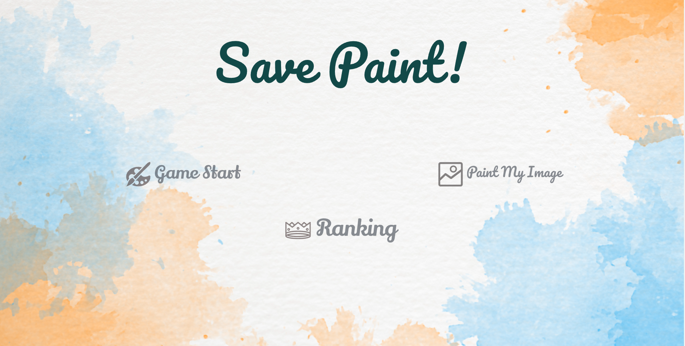
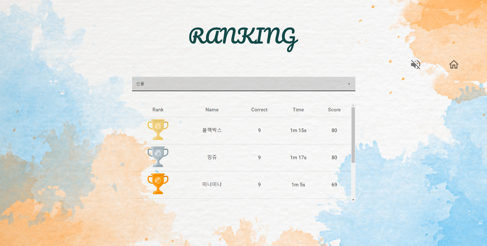
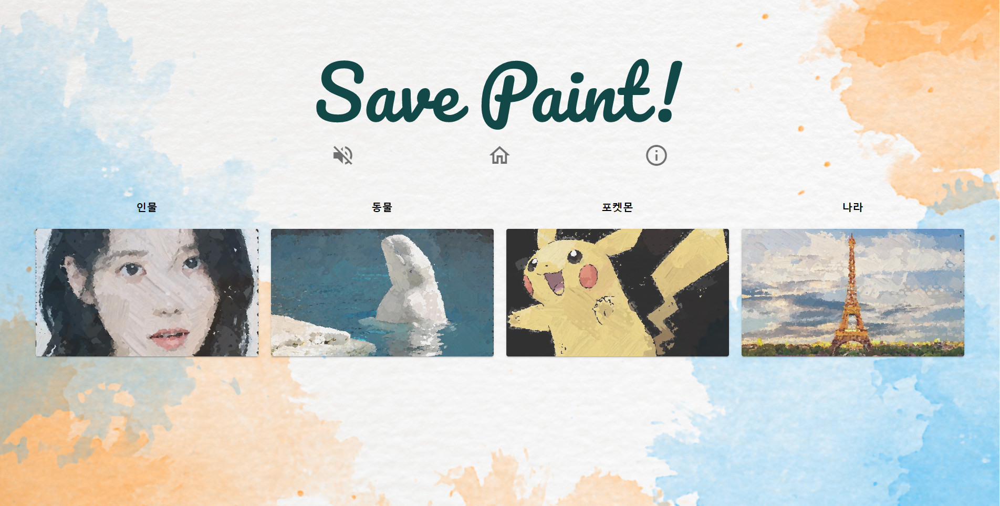
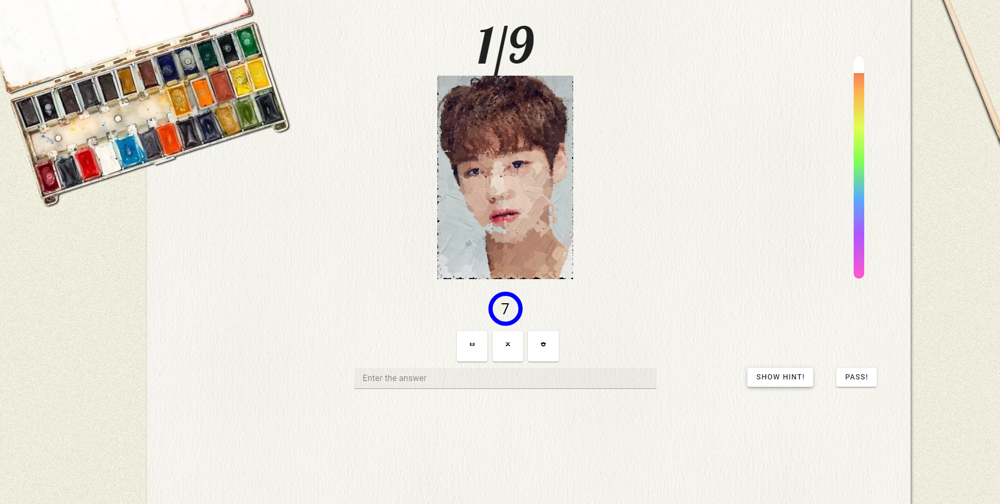
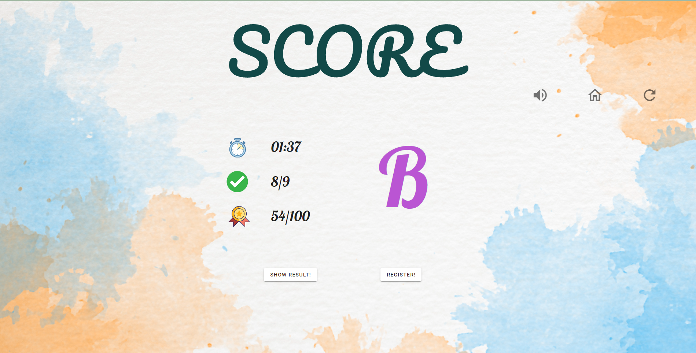
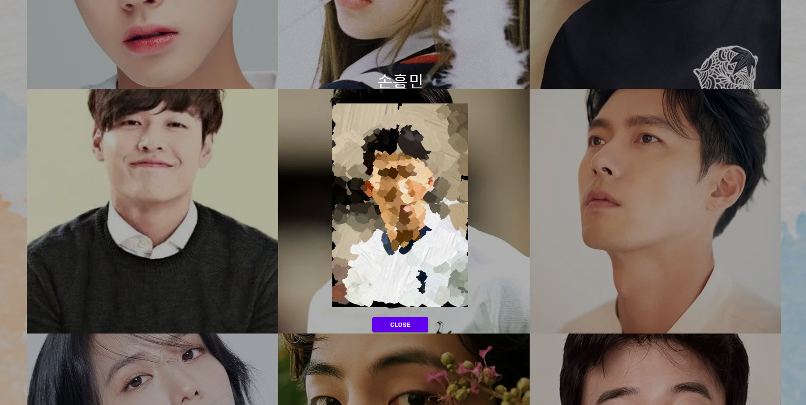

# 💡 프로젝트 소개

**1. AI가 각 카테고리에 맞는 랜덤한 그림을 그려요. 무슨 그림인지 맞혀보세요!**

**2. 그림 변환을 원하는 사진을 업로드하면 AI가 그림으로 바꿔줘요!**

**3. 다른 사람들은 얼마나 잘 맞혔을까? 랭킹을 통해 확인해 보세요!**

**4. 안드로이드 환경에서도 플레이할 수 있습니다. 다양한 환경에서 즐겨보세요!**

# 🔗[게임 링크](http://bit.ly/savepaint)

# 🎮 시연 영상

# 

# 🛠️ Tech Skill

 

 

 

# 💬communication

# 👨‍💻 팀원 소개

| 이름   | 역할                                              |
| ------ | ------------------------------------------------- |
| 강민수 | 프론트엔드 및 API 관리                            |
| 나성근 | 프로젝트 기획, 프로토타입 제작 및 프론트엔드 작업 |
| 박시형 | 백엔드 API 로직 작성 및 DB관리                    |
| 신성윤 | 모델 수정, 재학습 및 데이터셋 추가                |
| 오주헌 | Airflow를 활용한 데이터 파이프라인 제작           |

## 주요기능

<table>
    <tr>
      <td align="center">메인</td>
      <td align="center">랭킹</td>
    </tr>
    <tr>
      <td align="center"></td>
      <td align="center"></td>
    </tr>
    <tr>
      <td align="center">카테고리 선택</td>
      <td align="center">게임</td>
    </tr>
    <tr>
      <td align="center"></td>
      <td align="center"></td>
    </tr>
    <tr>
      <td align="center">게임 결과 확인</td>
      <td align="center">결과 이미지 확인</td>
    </tr>
    <tr>
      <td align="center"></td>
      <td align="center"></td>
    </tr>
 </table>

# 📃Model

 
<a href="https://arxiv.org/pdf/2108.03798.pdf"> Paint Transformer </a>

# ⚙️Pipeline

